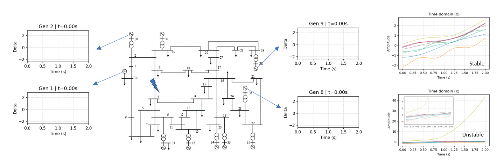
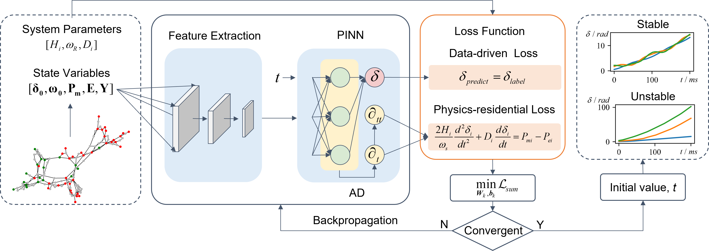
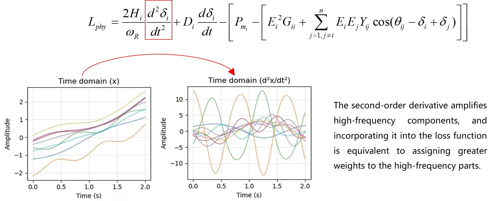
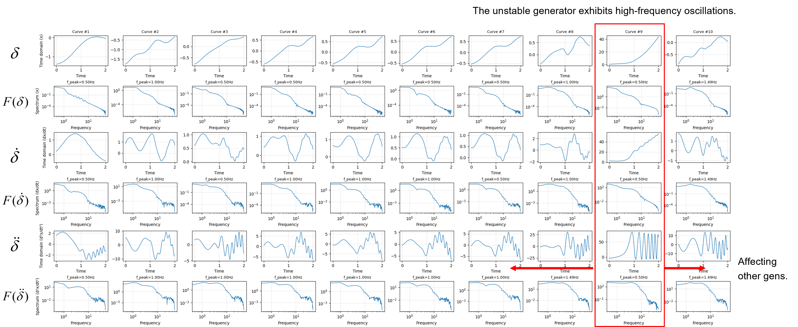
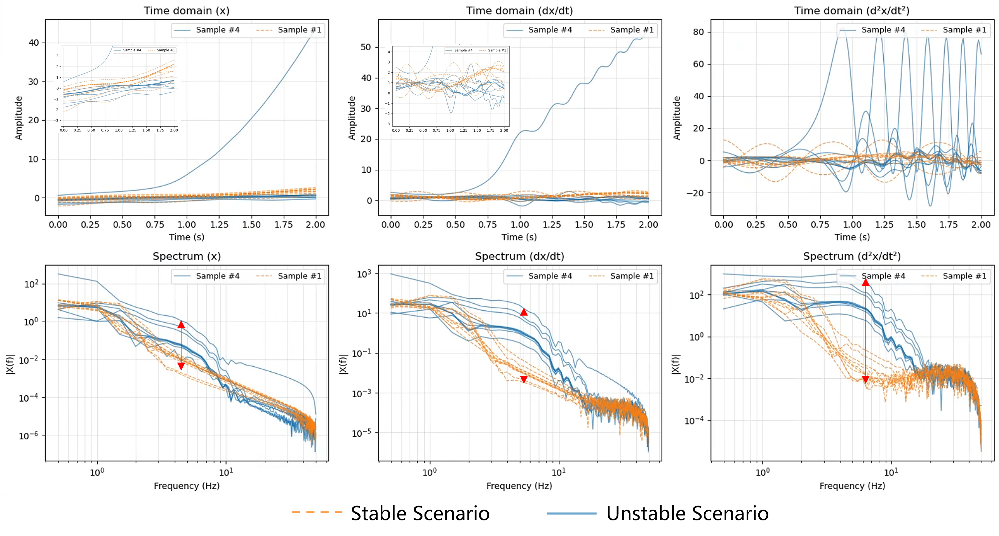

# Understanding PINN Training Dynamics
This repository presents the main figures and visualized results of the paper *Understanding PINN Training Dynamics: Frequency Principle and Its Mitigation in Power System Transient Stability*.

## 使用 PINN 进行电力系统暂态稳定分析
- **任务**：模拟故障后数秒内同步发电机的功角轨迹，进行稳定性判断

- **本质**：求解转子摇摆方程

  

- **核心思想**：将 PDE/ODE 残差写入损失函数，对网络进行**软约束**  
- **损失函数构成**：数据误差 + 物理残差 + 边界/初值（利用自动微分在网络输出上直接求导）

  

---

## 关键问题（Q&A）
- **Q1：为什么 PINN 能够提升拟合复杂非线性的能力？**  

- **Q2：只是在 loss 里加入物理项就足够了吗？**  
  A：在一般稳定场景下可显著提升收敛性；但在**失稳场景**中仍存在训练困难，需要在网络结构与表示能力上进一步改进（见最后的 SD-PINN 结构）。

---

## 实证观察
### 观察 1：仅用数据训练（DNN）
- 在平坦与振荡特征并存的序列中，网络更偏好**平坦特征**。  
- 训练先学“**轮廓**”（低频），再补“**细节**”（高频）。

> 这对应 **频率原则（Frequency Principle）**：标准 MLP 在梯度下降中倾向优先拟合低频分量，随后才逐步拟合高频分量。  
> 参考文献：Xu, Zhi-Qin John; Zhang, Yaoyu; Xiao, Yanyang. *Training behavior of deep neural networks in frequency domain.* arXiv: [1807.01251](https://arxiv.org/abs/1807.01251)

  
  

### 观察 2：加入物理残差训练（PINN）
- 引入物理残差后，**整体误差下降更快、收敛更稳**。

- 物理残差对高频误差的梯度**显著放大**

  

- 网络被迫修正高频细节，因而更快收敛、误差更低。

> 物理残差项在频域上对高频误差具有放大效应，促使网络更快纠正高频细节，从而提升整体拟合质量与稳定性。

### 观察 3：稳定 vs 失稳场景
- **失稳场景更难训练**：其收敛速度显著慢于稳定场景,主要是由于二阶导数中出现高频信号，很难学习（图中第四行）
- 即便加入物理约束，失稳样本的最终精度仍**难以达到**稳定样本水平。

---

## 失稳场景的特性与挑战
- 失去同步后，功角轨迹中出现**高频振荡**。由于发电机间的电磁功率耦合，**高频信号会在多机之间传播**。

  

- 相比稳定场景，**高频分量显著增多**，在一阶/二阶导数中差异尤为明显。高频增多导致 PINN 在失稳场景中的训练效果**显著下降**（更难逼近高频细节）。

  

---

## 结论与改进方向
- 仅依靠在损失中加入物理项并不足以完全解决失稳场景的学习难题。  
- 因此需要从**网络结构**上进一步引导高/低频的分工与表示能力，提出 **SD-PINN**（子空间分解的 PINN）结构作为后续改进方向。

