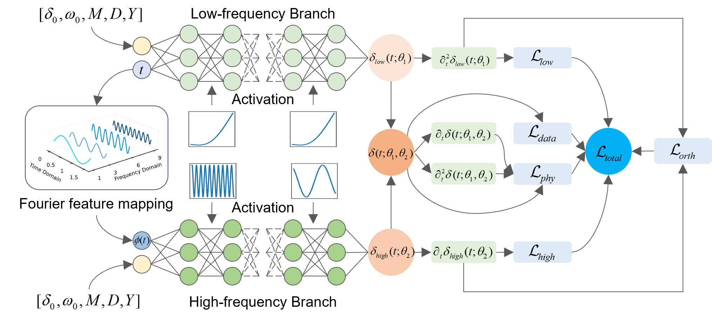

# Understanding PINN Training Dynamics
This repository presents the main figures and visualized results of the paper *Understanding PINN Training Dynamics: Frequency Principle and Its Mitigation in Power System Transient Stability*.

## Transient Stability Analysis with PINNs
- **Task:** Simulate rotor-angle trajectories of synchronous generators in the few seconds following a fault and assess stability.

- **Essence:** Solve the swing equations.

  

- **Core idea:** Embed PDE/ODE residuals into the loss as **soft physics constraints**.  
- **Loss composition:** data error + physics residual + boundary/initial conditions (derivatives taken on network outputs via automatic differentiation).

  

---

## Key Questions
- **Q1: Why do PINNs improve the fitting of complex nonlinear dynamics?**  
- **Q2: Is adding a physics term to the loss sufficient by itself?**  

---

## Empirical Observations
### Observation 1: Data-only training (DNN)
- In sequences containing both flat and oscillatory patterns, the network prefers **flat (low-frequency) features**.  
- Training first learns the **outline** (low frequency), then refines **details** (high frequency).

> This reflects the **Frequency Principle**: standard MLPs trained by gradient descent tend to fit low-frequency components first, then gradually capture high-frequency components.  
> Reference: Xu, Zhi-Qin John; Zhang, Yaoyu; Xiao, Yanyang. *Training behavior of deep neural networks in frequency domain.* arXiv: [1807.01251](https://arxiv.org/abs/1807.01251)

  
  

### Observation 2: Training with physics residuals (PINN)
- With physics residuals, **overall error drops faster and convergence is more stable**.

- The physics residual **amplifies gradients of high-frequency errors**.

  

- The network is forced to correct high-frequency details, leading to faster convergence and lower error.

> **<mark>Answering Q1</mark>**  
> In the frequency domain, the physics residual amplifies high-frequency error components, prompting earlier correction of oscillatory details and improving overall fit and stability.

### Observation 3: Stable vs. unstable scenarios
- **Unstable cases are harder to train:** convergence is markedly slower than in stable cases, mainly because strong high-frequency content appears in second derivatives and is difficult to learn (see the fourth row).
- Even with physics constraints, final accuracy on unstable samples remains **inferior** to that on stable ones.

---

## Characteristics and Challenges in Unstable Cases
- After loss of synchronism, rotor-angle trajectories exhibit **high-frequency oscillations**. Due to electromagnetic power coupling among generators, **high-frequency content propagates across machines**.

  

- Compared with stable cases, **high-frequency components are substantially increased**, especially evident in first/second derivatives. This increase degrades PINN training in unstable scenarios (**harder to approximate high-frequency details**).

  

> **<mark>Answering Q2</mark>**  
> Simply adding physics terms to the loss is insufficient to fully address learning in unstable scenarios.  
> We therefore guide low-/high-frequency modeling through **network architecture**, proposing **SD-PINN** (a subspace-decomposition PINN) as a mechanism-aware enhancement.

---

## Proposed Method
### SD-PINN Architecture
The proposed **SD-PINN** adopts parallel low- and high-frequency branches, improving training in light of the **frequency principle** to achieve explicit spectral decoupling and faster convergence.  
- **Inputs:** Introduce multi-frequency Fourier feature mapping \(\phi(t)\) for time and concatenate with system-state features, explicitly supplying high-frequency bases to enhance cross-band representational capacity.  
- **Activations:** Use SiLU in the low-frequency branch to emphasize smooth trends and suppress unnecessary high-frequency content; use SIREN-like sinusoidal activations in the high-frequency branch with a first-layer frequency amplification factor \(\omega_0\) to accelerate learning of oscillatory components.  
- **Losses:** On top of data and physics residual terms, add spectral regularization with band constraints and a normalized inner-product orthogonality constraint based on second derivatives.

  

### Training Results
- The proposed SD-PINN markedly improves fitting in unstable scenarios, capturing high-frequency signals from early training stages.

  

- Frequency-resolved convergence clearly reveals the frequency principle; SD-PINN substantially accelerates convergence of high-frequency components.

  

- Inspecting the low- and high-frequency outputs over time shows that the two branches successfully focus on distinct frequency bands.

  

## Conclusion
- Neural network training follows the frequency principle: easy-to-learn first, low frequency first.
- PINNs strengthen high-frequency components in the spectral domain: they accelerate learning of oscillations and improve physical consistency.
- Model bias should match data characteristics: high-frequency oscillations in unstable samples require targeted treatment.
- SD-PINN efficiently captures distinct frequency bands, with particular gains on high-frequency dynamics.

